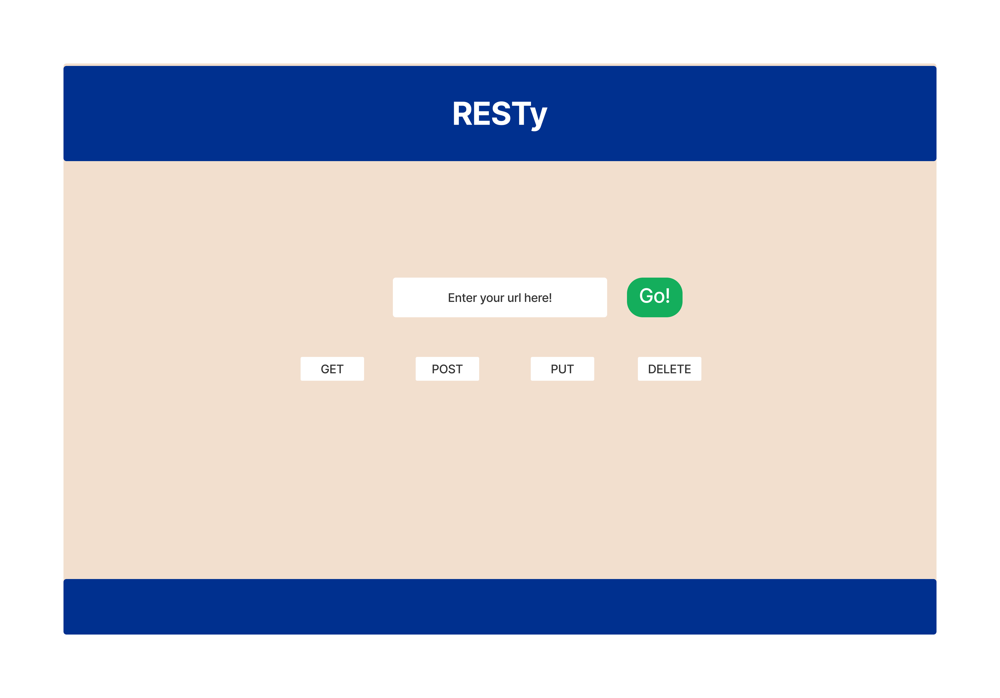

# Lab-27

## Testy - Phase 2

### Author: Alan Chelko

## Problem Domain

    * Today, we begin the first of a 4-Phase build of the RESTy application, written in React. 
    * In this first phase, our goal is to setup the basic scaffolding of the application, with intent being to add more functionality to the system as we go. 
    * This initial build sets up the file structure so that we can progressively build this application in a scalable manner

## Requirements

* Convert all child components of App.js from classes to functions
  * The App component serves as the container for all sub-components of this application.
  * Leave this component as a Class.
  * Make sure all base styles for App are included in a .scss imported within App.js.
  * Ensure that the Header, Footer, Results and Form components are imported using ES6 import syntax.
* Use .scss files to style each component
  * Each of the components use their own .scss file for styling.
* Core application functionality should remain unchanged:
  * The <Form> component should:
  * Call a function on submit that updates the <App/> component via a function sent down as a prop so that the app can process the form values.
  * The <Results/> component should show mock API results.

## Testing

    * NOTE: For this assignment, testing is not required.
   
## Setup

    * PORT: 3000

### Deployed server

    * Heroku: [chelko-basic-api-server-prod](https://dashboard.heroku.com/apps/chelko-bearer-auth-prod/)

### Running the app

    * npm start
 
### Running the tests

    * npm test

### UML: Basic Auth Server -- Lab 06 UML

